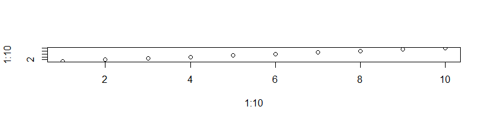
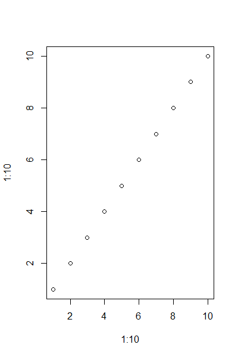
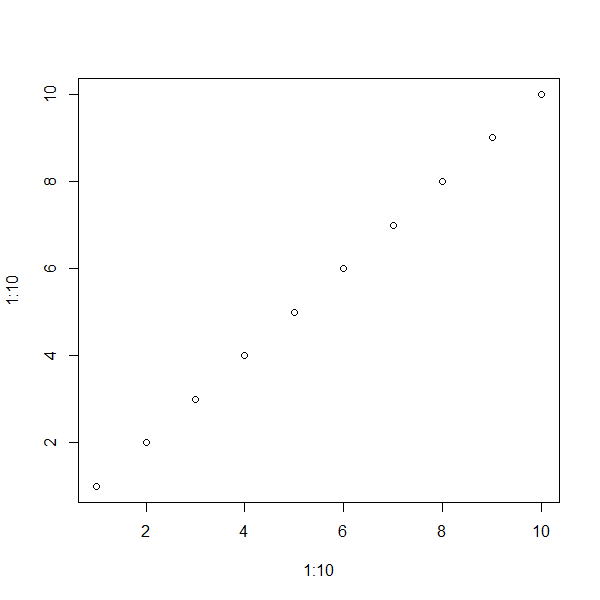
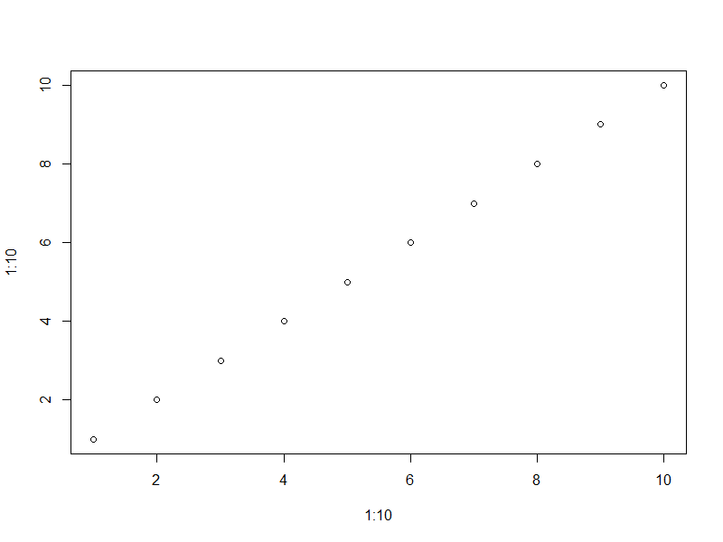

- [Introduction](#Introduction)
  - [Reference word document (template)](#Reference-word-document-(template))
- [Testing figure sizes](#testing-figure-sizes)

# Introduction

Convert markdown/Rmarkdown files to pdf via word to ensure accessibility checks pass.

* Write document in markdown
* Save as R markdown and add yaml header
    + output to docx via a reference doc (template)
* Open word doc and convert to pdf

## Reference word document (template)

To have control over formatting you will need to create a template word docx file.
This file should specify things like:

* Title
* Heading 1
* Heading 2
* ...
* Footers
* Headers
* Fonts
* Image styling

etc.

# Testing figure sizes

All images were created with a resolution of 96 dpi.

Each figure has different number of horizontal and vertical pixels. 

Mouse over the image to see its dimensions

 

 

 

 

 

 

 

 

 

 

 

 