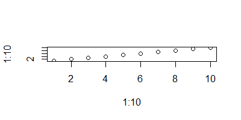

- [Who is this document for?](#who-is-this-document-for)
- [Step in process](#steps-in-process)
  - [Reference word document](#reference-word-document)
  - [YAML header](#yaml-header)
- [Testing figure sizes](#testing-figure-sizes)


# Who is this document for?

This document is for people who prefer to use flavors of markdown for their document writing instead of Microsoft Word.
When writing in markdown issues arise when converting to pdf. In particular alt text for images are not displayed or transferred resulting in pdfs failing to pass accessibility checks. This document attempts to resolve this issue.

# Steps in process

Convert markdown/Rmarkdown files to pdf via word to ensure accessibility checks pass.

* Write document in markdown
* Save as R markdown and add yaml header
    + output to docx via a reference doc (template)
* Knit the Rmd file
* Open word doc and convert to pdf
* open pdf and perform a `full check` (found in the accessibility tab)

## Reference word document

To have control over formatting you will need to create a template word docx file.
This file should specify things like:

* Title
* Heading 1
* Heading 2
* ...
* Footers
* Headers
* Fonts
* Image styling

etc.

## YAML header

This can be as simple as:

```
---
title: Create an accessible pdf from markdown
output: 
  word_document: 
    reference_docx: template/reference.docx
---

```

The reference word document (reference.doc) in this example was saved in a direcory called `template`


# Testing figure sizes

All images were created with a resolution of 96 dpi.

Each figure has different number of horizontal and vertical pixels. 

Mouse over the image to see its dimensions


 

 

 

 

 

 

 

 

 

 

 

 