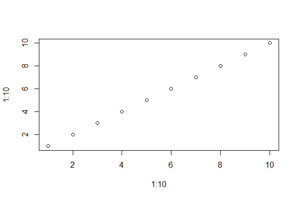

## Table of contents

- [Who is this document for?](#who-is-this-document-for)
- [Step in process](#steps-in-process)
- [Testing figure sizes](#testing-figure-sizes)


## Who is this document for?

This document is for people who prefer to use flavors of markdown for their document writing instead of Microsoft Word.
When writing in markdown issues arise when converting to pdf. In particular alt text for images are not displayed or transferred resulting in pdfs failing to pass accessibility checks. 

## Steps in process

* Knit the Rmd file
* Edit the `tex` file created
* Add the following code to the `tex` file right above the line `\documentclass{article}`

```
\DocumentMetadata{
 lang=en,
 pdfversion=2.0,
 pdfstandard=ua-2,
 pdfstandard=a-4,
 testphase=
   {
    phase-III, %lists,footnotes,sectioning,
               %toc,marginpar,bibliography,floats,
               %graphics ...
    math,  
    table, %tabular, tabularx, longtable
    title  %maketitle
   }
 }
```
* Save and compile this `tex` file by clicking the "Compile PDF" button in RStudio
* open pdf and perform a `full check` (found in the accessibility tab)

## Testing figure sizes

All images were created with a resolution of 96 dpi.

Each figure has different number of horizontal and vertical pixels. 

Mouse over the image to see its dimensions

**Note: the figure caption will be the name of the image file path**

### Include a file

```{r test6, echo=FALSE, out.width="600px"}

```


### Create an image from a code chunk

```{r eocdata-gsi, echo=FALSE,out.width="600px",fig.alt="dsfs"}
ecodata::plot_gsi()
```